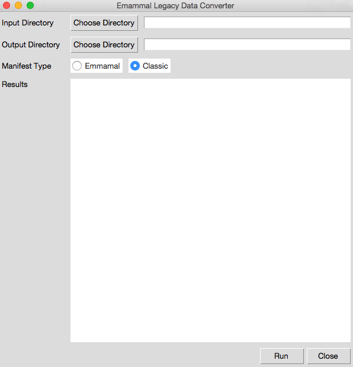

## Description

This is a python desktop tool for to convert Emammal Legacy Data into into a standardized XML that is excepted by the repository group.

## Requirements
  - [Python 2.7.*](https://www.python.org/downloads/)
  - [Python Package manager (PIP)](https://pip.pypa.io/en/stable/installing/)

## Install
####  Step 1: Set Windows Environment variables (OSX can skip to step 2)
 Confirm python & the python/scripts directory are pathed to the system environment variables.

###### --IMPORTANT--
**** Your python paths may be different depending on your version local system ****

 Test if python is already available:

    C:\> python

 If and errors try one of the two methods

    C:\> [Environment]::SetEnvironmentVariable("Path", "$env:Path;C:\Python27;C:\Python27\Scripts", "Machine")

  **OR**

  See how to do set environmental variables via GUI

  [http://www.computerhope.com/issues/ch000549.htm](http://www.computerhope.com/issues/ch000549.htm)

##### Restart PowerShell and verify you see Python installed:
      PS C:\> python
      $ > Python 2.7 (r27:82525, Jul  4 2010, 07:43:08) [MSC v.1500 64 bit (AMD64)] on win32
      $ > Type "help", "copyright", "credits" or "license" for more information.
      $ > >>> exit()

### Step 2: Instal PIP and Dependencies

##### Change directory into emammal-csv-manifest directory

  Dependencies are in the 'includes' directory

  For example:

    C:\> cd C:\Users\jnordling\emammal-csv-manifest

#### Install python package manager (PIP)
  [Online instructions](https://pip.pypa.io/en/stable/installing/)

  Download PIP https://bootstrap.pypa.io/get-pip.py

    C:~\> python get-pip.py
    C:~\> pip install -r requirements.txt

## Start GIU

    C:\> python run.py

